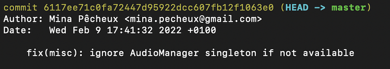

# Git Conventional Commits
> [Dernière mise à jour par @minapecheux-artline - 11/02/2022]

Les **"conventional commits"** sont un ensemble de bonnes pratiques pour la rédaction des messages de commits.

Pour plus d'infos (lien en anglais) : https://www.conventionalcommits.org/en/v1.0.0/.

## Petits rappels sur les commits

Quand on utilise Git, le **commit** est l'élément atomique. C'est lui qui marque un nouvel état dans l'historique : ajout de fonctionnalité, correction de bug, refonte de l'organisation... Il doit toujours obligatoirement contenir un **message** qui explique rapidement les modifications effectuées dans le commit.

*Note: on peut aussi rajouter un message long, le "corps" du commit, qui est optionnel, mais qui peut être utile si le commit a un impact très important sur le projet, marque un breaking change, etc.*

Au final, quand on parcourt l'historique de notre projet Git, on parcourt donc la liste des commits. Et, dans une première lecture, on a accès à seulement une poignée d'informations :



- le hash du commit : c'est la chaîne de caractères hexadécimaux assez illisible qui sert d'identifiant unique et permet de facilement retrouver ce commit, le rétablir comme état courant, etc.
- la branche sur laquelle il a été fait (ici `master`)
- l'auteur et la date
- et le message !

Du coup, mieux vaut que ce message soit explicite, sinon, on risque d'être vite perdu dans notre historique...

**Bonus :** quand on utilise une norme (= un standard) pour écrire nos messages de commits, ceux-ci peuvent ensuite être "parsés" par des outils pour automatiquement générer de la doc, un changelog, ou même déterminer la nouvelle version du projet dans le [système SemVer](https://semver.org/)... :)

## Les "conventional commits" à la rescousse !

### Structure générale

On l'a dit, les "conventional commits", ce sont des règles usuelles qui proposent une **"bonne façon"** d'écrire nos **messages de commits**.

Plus précisément, les docs nous disent qu'un message de commit devrait être structuré de la façon suivante :

```
<type>[scope optionnel]: <description>

[corps optionnel]

[footer(s) optionnel(s)]
```

Par exemple, on peut donc imaginer, pour le même travail sur un petit jeu vidéo, 2 messages de commits plus ou moins détaillés :

- "version rapide" :
  
  ```
  feat: gestion des contrôles pour le joueur
  ```

- "version longue" : 
  
  ```
  feat(io): gestion des contrôles pour le joueur

  Ajout des contrôles pour déplacer le personnage vers la gauche, la droite et pour sauter.

  Utilise le nouveau système d'inputs.
  ```

On peut évidemment faire un compromis et prendre un niveau "intermédiaire" de détail - souvent, on utilise le type, le scope et la description.

### Types de commits

Toujours dans l'optique d'avoir quelque chose de lisible et de normé, les "conventional commits" nous proposent aussi une liste de **types** pour nos commits :

**Types de base**
- `feat` (pour "feature") : ajout d'une nouvelle fonctionnalité
- `fix` : résolution d'un bug
- `refactor` : refonte d'un système, d'une lib... qui ne modifie pas les fonctionnalités du code (pas de nouvelle fonctionnalité, pas de correction)

**Autres types couramment utilisés** (qui viennent de la [Angular convention](https://github.com/angular/angular/blob/22b96b9/CONTRIBUTING.md#-commit-message-guidelines))
- `build` : modification de la configuration ou des outils pour la mise en production
- `ci` : modification de la configuration ou des outils pour l'intégration continue
- `revert` : pour "revenir" sur un commit précédent et rétablir l'état précédent à ce commit ; en général, on précise dans le commit de `revert` le hash du commit qui est "annulé" pour aider à la lisibilité de l'historique
- `docs` : mise à jour de la documentation
- `chore` : tâche de nettoyage, secondaire, un peu "fourre-tout"
  
### Scope du commit

Le "**scope**", c'est un ou quelques mots qui décrivent le système/le morceau de code qui est touché par le commit. Cette donnée est laissée à l'appréciation de la personne qui fait le commit, car elle dépend de chaque projet.

Toujours pour notre petit exemple de jeu vidéo, ça pourrait être : "core" (système essentiel au fonctionnement), "assets" (import/modification d'une ressource), "ui" (changement d'un élément du GUI)...

**Conseil :** éviter de multiplier les scopes ! Si d'autres avant vous ont déjà créé des commits avec des scopes qui vous semblent convenir, réutilisez-les :)

### Description du commit

La **description**, c'est le coeur du commit - elle dit brièvement mais précisément ce qui a été ajouté, enlevé ou modifié.

C'est là qu'il faut réussir à résumer au mieux son travail pour qu'un autre membre de l'équipe (ou même vous dans le futur) puisse comprendre l'intérêt du commit et ses possibles répercussions sur le projet.

*Note: petit détail, mais la langue à utiliser dépend bien sûr du projet (et notamment de si les autres collaborateurs parlent français, anglais... !).*

## Autres remarques

1. Souvent, le premier commit d'un dépôt Git est un peu simple et échappe à ces règles, car beaucoup aiment commencer leur dépôt par le commit : `initial commit`.
2. Les "conventional commits" recommandent de préciser les cas de *breaking changes*, autrement dit les changements qui cassent la rétro-compatibilité avec les versions antérieures. A priori, ces *breaking changes* peuvent avoir lieu avec n'importe quel type de commit (`feat`, `fix`, `build`...).
   
   Pour préciser un *breaking change*, on peut : soit ajouter un point d'exclamation `!` après le scope (ex : `feat(core)!: ...`), soit ajouter le préfixe "BREAKING CHANGE:" au début du footer du commit.
